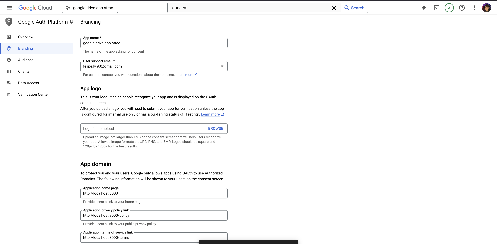

# Google Drive Manager App

A modern Next.js application that provides a clean interface for managing Google Drive files, featuring OAuth2
authentication and core file operations.

## Features

- 🔐 Secure Google OAuth2 authentication
- 📂 Browse and navigate Drive folders
- ⬆️ File upload with progress tracking and drag-n-drop
- ⬇️ File download
- 🔍 File preview (images, PDFs, Google Docs * In Progress *)
- 🗑️ File deletion
- 🔄 Real-time updates
- 📱 Responsive design

## Prerequisites

- Node.js 18+ and npm
- Git
- A Google Cloud Platform account

## Setup Instructions

### 1. Clone the Repository

```bash
git clone https://github.com/FelipeLVieira/google-drive-app-strac
cd google-drive-manager
```

### 2. Install Dependencies

```bash
npm install
```

### 3. Google Cloud Platform Setup

1. Go to [Google Cloud Console](https://console.cloud.google.com)
2. Create a new project or select an existing one
3. Enable the Google Drive API for your project

#### Configure OAuth Consent Screen



1. Go to "OAuth consent screen" in the left sidebar
2. Choose "External" as the User Type
3. Fill in the required application information:
    - App name: "google-drive-app-strac"
    - User support email: Your email
    - Application homepage: http://localhost:3000
    - Application privacy policy: http://localhost:3000/policy
    - Application terms of service: http://localhost:3000/terms

#### Create OAuth 2.0 Client ID


1. Go to "Credentials" in the left sidebar
2. Click "Create Credentials" > "OAuth client ID"
3. Choose "Web application"
4. Set authorized JavaScript origins:
   ```
   http://localhost:3000
   ```
5. Set authorized redirect URIs:
   ```
   http://localhost:3000/api/auth/callback/google
   ```

#### Configure API Scopes


Required scopes for the application:

- /auth/drive.file
- /auth/drive.readonly
- /auth/spreadsheets.readonly
- /auth/documents.readonly
- /auth/presentations.readonly
- /auth/drive.photos.readonly
- /auth/drive.metadata.readonly
- openid
- email
- profile

### 4. Environment Setup

Create a `.env.local` file in the root directory with the following variables:

```env
GOOGLE_CLIENT_ID=your-client-id
GOOGLE_CLIENT_SECRET=your-client-secret
NEXTAUTH_URL=http://localhost:3000
NEXTAUTH_SECRET=your-nextauth-secret
```

#### Generating NEXTAUTH_SECRET

Generate a secure random string for NEXTAUTH_SECRET using one of these methods:

1. Using OpenSSL (recommended):

```bash
openssl rand -base64 32
```

2. Using Node.js:

```bash
node -e "console.log(require('crypto').randomBytes(32).toString('hex'))"
```

### 5. Run the Development Server

```bash
npm run dev
```

Visit [http://localhost:3000](http://localhost:3000) to see your application running.

## Important Configuration Screenshots

1. [OAuth Consent Screen Configuration](docs/images/1.png)
2. [Publishing Status and User Type](docs/images/2.png)
3. [OAuth Client Creation](docs/images/3.png)
4. [Client ID and Redirect URIs](docs/images/4.png)
5. [API Scopes Configuration](docs/images/5.png)

## Project Structure

```
├── app/
│   ├── api/            # API routes
│   ├── components/     # React components
│   └── providers/      # Context providers
├── lib/               # Utility functions
├── types/             # TypeScript definitions
├── public/            # Static assets
└── tests/             # Test files
```

## Testing

```bash
# Run unit tests
jest test

# Run tests in watch mode
npm run test:watch
```

## Security Considerations

- Always keep your `.env.local` file secure and never commit it to version control
- Regularly rotate your client secrets
- Monitor your application's usage in the Google Cloud Console
- Keep dependencies updated to patch security vulnerabilities

## License

This project is licensed under the MIT License - see the LICENSE file for details.
